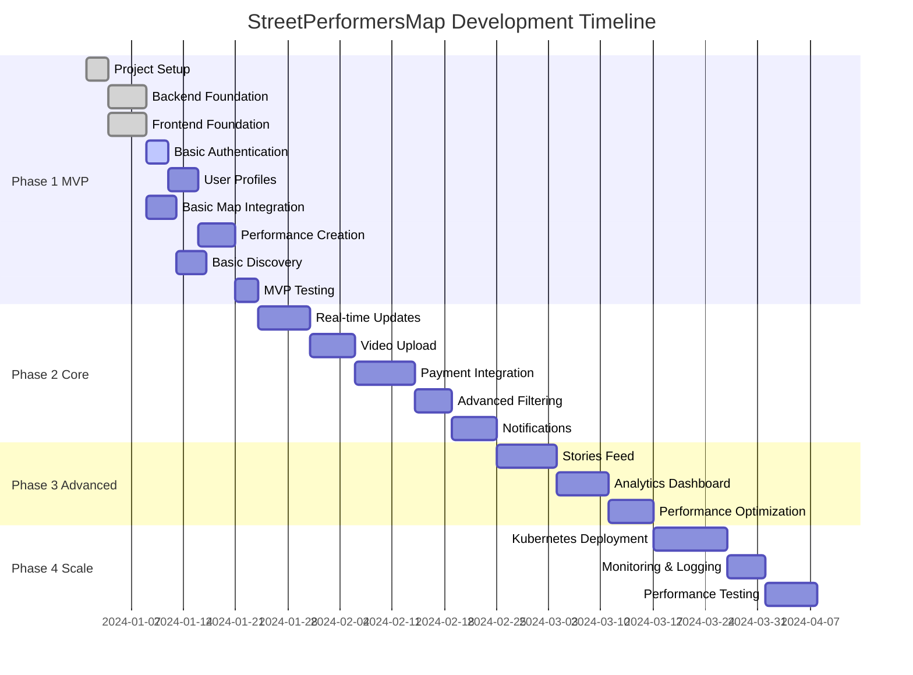

# 🎯 StreetPerformersMap - Task Master & Implementation Plan

## 📋 Table of Contents
1. [Project Phases Overview](#project-phases-overview)
2. [Phase 1: Foundation & MVP](#phase-1-foundation--mvp)
3. [Phase 2: Core Features](#phase-2-core-features)
4. [Phase 3: Advanced Features](#phase-3-advanced-features)
5. [Phase 4: Scale & Optimize](#phase-4-scale--optimize)
6. [Development Guidelines](#development-guidelines)
7. [Testing Strategy](#testing-strategy)
8. [Deployment Strategy](#deployment-strategy)

---

## 🌟 Project Phases Overview



---

## 🚀 Phase 1: Foundation & MVP (3-4 weeks)

### **Milestone 1.1: Project Setup & Infrastructure (3 days)**

#### **Task 1.1.1: Repository Setup**
- [x] Create monorepo structure with pnpm workspaces
- [x] Setup TypeScript configurations for frontend and backend
- [ ] Configure ESLint, Prettier, and Husky for code quality
- [ ] Setup GitHub Actions for CI/CD pipeline
- [ ] Create Docker configurations for local development

```bash
# Expected deliverable: Working development environment
street-performers-map/
├── apps/
│   ├── frontend/
│   └── backend/
├── packages/
│   ├── shared-types/
│   └── ui-components/
├── docker-compose.yml
├── package.json
└── README.md
```

#### **Task 1.1.2: Backend Foundation Setup**
- [x] Initialize Express.js with TypeScript
- [x] Setup Domain-Driven Design folder structure
- [x] Configure MongoDB connections
- [ ] Setup Redis for caching
- [x] Create base middleware (CORS, helmet, rate limiting)

```typescript
// Expected deliverable: Basic Express server
import express from 'express';
import { createServer } from 'http';
import { setupMiddleware } from './middleware';
import { connectDatabases } from './infrastructure/database';

const app = express();
const server = createServer(app);

setupMiddleware(app);
await connectDatabases();

app.get('/health', (req, res) => {
  res.json({ status: 'ok', timestamp: new Date().toISOString() });
});

server.listen(3001, () => {
  console.log('🚀 Server running on port 3001');
});
```

#### **Task 1.1.3: Frontend Foundation Setup**
- [x] Initialize React app with Vite
- [x] Setup React Router (switched from TanStack Router)
- [x] Configure Zustand for state management
- [x] Setup Tailwind CSS
- [x] Create basic layout components

```typescript
// Expected deliverable: React app with routing
import { createBrowserRouter, RouterProvider } from '@tanstack/react-router';
import { QueryClient, QueryClientProvider } from '@tanstack/react-query';

const queryClient = new QueryClient();

function App() {
  return (
    <QueryClientProvider client={queryClient}>
      <RouterProvider router={router} />
    </QueryClientProvider>
  );
}
```

**Milestone 1.1 Success Criteria:**
- ✅ Development environment runs locally
- ✅ Frontend and backend communicate
- ✅ Databases connect successfully
- ✅ CI/CD pipeline passes

---

### **Milestone 1.2: Authentication & User Management (7 days)**

#### **Task 1.2.1: Backend Authentication**
- [x] Implement JWT authentication service
- [x] Create User entity and repository
- [x] Build registration and login endpoints
- [x] Add password hashing with bcrypt
- [x] Implement role-based access control

```typescript
// Expected deliverable: Authentication service
export class AuthService {
  async register(userData: RegisterDto): Promise<AuthResponse> {
    const hashedPassword = await bcrypt.hash(userData.password, 12);
    const user = await this.userRepository.create({
      ...userData,
      password: hashedPassword
    });
    
    const token = this.jwtService.sign({ sub: user._id, role: user.role });
    return { user, token };
  }
  
  async login(credentials: LoginDto): Promise<AuthResponse> {
    // Implementation
  }
}
```

#### **Task 1.2.2: Frontend Authentication**
- [x] Create authentication store with Zustand
- [x] Build login and registration forms
- [x] Implement protected routes
- [x] Add token management and refresh logic
- [ ] Create user profile components

```typescript
// Expected deliverable: Auth store and components
interface AuthStore {
  user: User | null;
  token: string | null;
  login: (credentials: LoginCredentials) => Promise<void>;
  register: (userData: RegisterData) => Promise<void>;
  logout: () => void;
}

export const useAuthStore = create<AuthStore>((set, get) => ({
  user: null,
  token: null,
  login: async (credentials) => {
    const response = await authApi.login(credentials);
    set({ user: response.user, token: response.token });
  },
  // ... other methods
}));
```

#### **Task 1.2.3: User Profile Management**
- [ ] Create user profile entity and schema
- [ ] Build profile update endpoints
- [ ] Implement profile image upload
- [ ] Create profile editing forms
- [ ] Add user preferences management

**Milestone 1.2 Success Criteria:**
- ✅ Users can register and login
- ✅ JWT tokens work correctly
- ✅ User profiles can be created and updated
- ✅ Protected routes function properly

---

### **Milestone 1.3: Basic Map & Performance Creation (8 days)**

#### **Task 1.3.1: Google Maps Integration**
- [x] Setup Google Maps API keys and configuration
- [x] Integrate React Google Maps library
- [x] Create basic map component with current location
- [x] Implement location search and geocoding
- [x] Add map markers and info windows

```typescript
// Expected deliverable: Map component
import { APIProvider, Map, Marker } from '@vis.gl/react-google-maps';

export function MapComponent({ performances }: { performances: Performance[] }) {
  return (
    <APIProvider apiKey={process.env.GOOGLE_MAPS_API_KEY}>
      <Map
        defaultCenter={{ lat: 40.7128, lng: -74.0060 }}
        defaultZoom={12}
        gestureHandling="greedy"
      >
        {performances.map(performance => (
          <Marker
            key={performance.id}
            position={performance.location.coordinates}
            onClick={() => handleMarkerClick(performance)}
          />
        ))}
      </Map>
    </APIProvider>
  );
}
```

#### **Task 1.3.2: Performance Creation Backend**
- [x] Create Performance entity with route planning
- [x] Build performance repository and service
- [x] Implement performance CRUD endpoints
- [x] Add route validation and optimization
- [x] Create performance status management

```typescript
// Expected deliverable: Performance service
export class PerformanceService {
  async createPerformance(data: CreatePerformanceDto, userId: string): Promise<Performance> {
    const performance = new Performance({
      ...data,
      performerId: userId,
      status: 'scheduled',
      expiresAt: new Date(Date.now() + 24 * 60 * 60 * 1000) // 24 hours
    });
    
    return await this.performanceRepository.save(performance);
  }
  
  async getNearbyPerformances(location: Coordinates, radius: number): Promise<Performance[]> {
    return await this.performanceRepository.findNearby(location, radius);
  }
}
```

#### **Task 1.3.3: Performance Creation Frontend**
- [x] Build performance creation form
- [x] Implement route planning interface
- [x] Add time scheduling for each stop
- [x] Create map-based location picker
- [x] Add performance preview and validation
- [x] Integrate Google Places Autocomplete for location search

**Milestone 1.3 Success Criteria:**
- ✅ Map displays correctly with user location
- ✅ Users can create performances with routes
- ✅ Performances appear on map as markers
- ✅ Route planning works with multiple stops
- ✅ Performance creation wizard works end-to-end
- ✅ Backend API endpoints are fully functional

---

### **Milestone 1.4: Basic Discovery & MVP Testing (7 days)**

#### **Task 1.4.1: Performance Discovery**
- [x] Implement nearby performance search (mock data)
- [x] Add basic filtering (genre, time)
- [x] Create performance list view
- [ ] Add performance detail modal
- [ ] Implement basic like functionality

#### **Task 1.4.2: MVP Testing & Bug Fixes**
- [ ] Write unit tests for core functionality
- [ ] Perform end-to-end testing
- [ ] Fix critical bugs and issues
- [ ] Optimize performance and loading times
- [ ] Prepare MVP for demo

**Phase 1 Success Criteria:**
- ✅ Complete user registration and authentication flow
- ✅ Users can create and view performances on map
- ✅ Basic discovery and filtering works
- ✅ Application is stable and deployable
- ✅ Performance creation system is fully functional
- ✅ Google Maps integration works with mock data

---

## ⚡ Phase 2: Core Features (4-5 weeks)

### **Milestone 2.1: Real-time Updates with WebSocket & Kafka (7 days)**

#### **Task 2.1.1: WebSocket Infrastructure**
- [ ] Setup Socket.io server with Redis adapter
- [ ] Implement room-based connections (city-based)
- [ ] Create WebSocket authentication middleware
- [ ] Add connection management and error handling
- [ ] Build client-side WebSocket service

```typescript
// Expected deliverable: WebSocket service
export class WebSocketService {
  private io: SocketServer;
  private redis: RedisAdapter;
  
  constructor() {
    this.io = new Server(server, {
      cors: { origin: process.env.FRONTEND_URL }
    });
    this.io.adapter(createRedisAdapter(redis));
  }
  
  async broadcastToCity(city: string, event: string, data: any) {
    this.io.to(`city-${city}`).emit(event, data);
  }
  
  async notifyFollowers(performerId: string, event: string, data: any) {
    const followers = await this.getFollowers(performerId);
    followers.forEach(follower => {
      this.io.to(`user-${follower.id}`).emit(event, data);
    });
  }
}
```

#### **Task 2.1.2: Kafka Event System**
- [ ] Setup Kafka cluster (local development)
- [ ] Create event schemas and topics
- [ ] Implement event producers and consumers
- [ ] Add event sourcing for performance updates
- [ ] Build retry and error handling mechanisms

```typescript
// Expected deliverable: Event system
interface PerformanceStartedEvent {
  type: 'PERFORMANCE_STARTED';
  performanceId: string;
  performerId: string;
  location: Coordinates;
  timestamp: string;
}

export class EventPublisher {
  async publishPerformanceStarted(performance: Performance) {
    const event: PerformanceStartedEvent = {
      type: 'PERFORMANCE_STARTED',
      performanceId: performance._id,
      performerId: performance.performerId,
      location: performance.currentLocation,
      timestamp: new Date().toISOString()
    };
    
    await this.kafka.send({
      topic: 'performance-events',
      messages: [{ value: JSON.stringify(event) }]
    });
  }
}
```

#### **Task 2.1.3: Real-time Map Updates**
- [ ] Implement live performance status updates
- [ ] Add real-time marker updates on map
- [ ] Create live viewer count display
- [ ] Build performance popularity indicators
- [ ] Add smooth animations for updates

**Milestone 2.1 Success Criteria:**
- ✅ Real-time updates work across all clients
- ✅ Performance status changes reflect immediately
- ✅ Map markers update in real-time
- ✅ System handles 100+ concurrent connections

---

### **Milestone 2.2: Video Upload & Streaming (6 days)**

#### **Task 2.2.1: Video Storage Infrastructure**
- [ ] Setup AWS S3 bucket for video storage
- [ ] Configure CloudFront CDN for video delivery
- [ ] Implement presigned URL generation
- [ ] Add video compression and optimization
- [ ] Create thumbnail generation service

```typescript
// Expected deliverable: Media service
export class MediaService {
  async uploadVideo(file: Buffer, userId: string): Promise<VideoUploadResponse> {
    const videoId = generateId();
    const s3Key = `videos/${userId}/${videoId}.mp4`;
    
    // Upload to S3
    await this.s3.putObject({
      Bucket: process.env.S3_BUCKET,
      Key: s3Key,
      Body: file,
      ContentType: 'video/mp4'
    });
    
    // Generate thumbnail
    const thumbnailUrl = await this.generateThumbnail(s3Key);
    
    // Save to database
    const video = await this.videoRepository.create({
      id: videoId,
      userId,
      url: `${process.env.CDN_URL}/${s3Key}`,
      thumbnail: thumbnailUrl,
      status: 'processing'
    });
    
    return { videoId, uploadUrl: video.url };
  }
}
```

#### **Task 2.2.2: Frontend Video Upload**
- [ ] Create drag-and-drop video upload component
- [ ] Implement upload progress tracking
- [ ] Add video preview before upload
- [ ] Build video compression on client-side
- [ ] Create video management interface

#### **Task 2.2.3: Video Playback & Optimization**
- [ ] Implement adaptive video streaming
- [ ] Add video player with custom controls
- [ ] Create video preloading strategies
- [ ] Build video quality selection
- [ ] Add video analytics tracking

**Milestone 2.2 Success Criteria:**
- ✅ Users can upload videos up to 30 seconds
- ✅ Videos are compressed and optimized automatically
- ✅ Video playback is smooth and fast
- ✅ Thumbnails generate correctly

---

### **Milestone 2.3: Payment Integration (8 days)**

#### **Task 2.3.1: Stripe Integration**
- [ ] Setup Stripe account and API keys
- [ ] Implement payment intent creation
- [ ] Build secure payment processing
- [ ] Add webhook handling for payment events
- [ ] Create payout system for performers

```typescript
// Expected deliverable: Payment service
export class PaymentService {
  private stripe = new Stripe(process.env.STRIPE_SECRET_KEY);
  
  async createTipPayment(amount: number, performerId: string, userId: string): Promise<PaymentIntent> {
    const paymentIntent = await this.stripe.paymentIntents.create({
      amount: amount * 100, // Convert to cents
      currency: 'eur',
      metadata: {
        performerId,
        userId,
        type: 'tip'
      }
    });
    
    // Save transaction record
    await this.transactionRepository.create({
      stripePaymentIntentId: paymentIntent.id,
      amount,
      performerId,
      userId,
      status: 'pending'
    });
    
    return paymentIntent;
  }
  
  async processPayout(performerId: string, amount: number): Promise<void> {
    const account = await this.getStripeAccount(performerId);
    await this.stripe.transfers.create({
      amount: amount * 100,
      currency: 'eur',
      destination: account.id
    });
  }
}
```

#### **Task 2.3.2: Bizum Integration (Spain-specific)**
- [ ] Research Bizum API integration options
- [ ] Implement Bizum payment flow
- [ ] Add Bizum-specific UI components
- [ ] Create fallback to Stripe for international users
- [ ] Test payment flows thoroughly

#### **Task 2.3.3: Payment UI & UX**
- [ ] Create tip modal with quick amounts
- [ ] Build payment method selection
- [ ] Implement payment confirmation flow
- [ ] Add payment history for users
- [ ] Create earnings dashboard for performers

**Milestone 2.3 Success Criteria:**
- ✅ Users can tip performers successfully
- ✅ Payments process securely and quickly
- ✅ Performers receive payouts correctly
- ✅ All financial data is accurate and auditable

---

### **Milestone 2.4: Advanced Filtering & Search (5 days)**

#### **Task 2.4.1: Enhanced Search Backend**
- [ ] Implement full-text search for performances
- [ ] Add geospatial queries with MongoDB
- [ ] Create advanced filtering logic
- [ ] Build search result ranking algorithm
- [ ] Add search analytics tracking

#### **Task 2.4.2: Frontend Search & Filters**
- [ ] Create advanced filter sidebar
- [ ] Implement search autocomplete
- [ ] Add filter persistence in URL params
- [ ] Build saved searches functionality
- [ ] Create search results optimization

#### **Task 2.4.3: Performance Optimization**
- [ ] Implement search result caching
- [ ] Add pagination for large result sets
- [ ] Optimize database queries
- [ ] Create search performance monitoring
- [ ] Add lazy loading for search results

**Milestone 2.4 Success Criteria:**
- ✅ Search returns relevant results quickly (<500ms)
- ✅ Filters work smoothly with real-time updates
- ✅ Search handles edge cases gracefully
- ✅ Performance metrics are within targets

---

### **Milestone 2.5: Notification System (6 days)**

#### **Task 2.5.1: Push Notification Infrastructure**
- [ ] Setup Firebase Cloud Messaging
- [ ] Implement device token management
- [ ] Create notification templates
- [ ] Build notification scheduling system
- [ ] Add notification preferences management

#### **Task 2.5.2: Notification Types & Logic**
- [ ] Performance start notifications for followers
- [ ] Tip received notifications for performers
- [ ] New follower notifications
- [ ] Nearby performance alerts
- [ ] System maintenance notifications

#### **Task 2.5.3: Frontend Notification Handling**
- [ ] Implement service worker for notifications
- [ ] Create in-app notification system
- [ ] Add notification permission requests
- [ ] Build notification history
- [ ] Create notification settings UI

**Phase 2 Success Criteria:**
- ✅ Real-time updates work flawlessly
- ✅ Video upload and playback is smooth
- ✅ Payment system processes tips correctly
- ✅ Advanced search provides relevant results
- ✅ Notifications engage users effectively

---

## 🌟 Phase 3: Advanced Features (3-4 weeks)

### **Milestone 3.1: Stories Feed (8 days)**

#### **Task 3.1.1: Stories Backend Architecture**
- [ ] Create Stories entity and repository
- [ ] Implement stories ranking algorithm
- [ ] Build stories feed generation
- [ ] Add stories analytics tracking
- [ ] Create stories expiration system

#### **Task 3.1.2: Instagram-style Stories UI**
- [ ] Build stories carousel component
- [ ] Implement touch/swipe navigation
- [ ] Create stories viewer with progress bars
- [ ] Add stories creation interface
- [ ] Build stories profile rings

#### **Task 3.1.3: Stories Performance Optimization**
- [ ] Implement stories preloading
- [ ] Add infinite scroll for stories feed
- [ ] Create stories caching strategy
- [ ] Optimize video loading for stories
- [ ] Add stories performance monitoring

**Milestone 3.1 Success Criteria:**
- ✅ Stories feed loads quickly and smoothly
- ✅ Stories navigation is intuitive and responsive
- ✅ Stories ranking shows most engaging content
- ✅ Performance is optimized for mobile devices

---

### **Milestone 3.2: Analytics Dashboard (7 days)**

#### **Task 3.2.1: Analytics Data Collection**
- [ ] Implement event tracking system
- [ ] Create analytics data models
- [ ] Build real-time analytics pipeline
- [ ] Add performance metrics calculation
- [ ] Create analytics data aggregation

#### **Task 3.2.2: Performer Analytics Dashboard**
- [ ] Build performance statistics charts
- [ ] Create earnings analytics
- [ ] Add audience engagement metrics
- [ ] Implement location performance analysis
- [ ] Create comparative performance reports

#### **Task 3.2.3: Platform Analytics (Admin)**
- [ ] Build platform-wide metrics dashboard
- [ ] Create user behavior analytics
- [ ] Add revenue and growth metrics
- [ ] Implement A/B testing framework
- [ ] Create automated reporting system

**Milestone 3.2 Success Criteria:**
- ✅ Performers can view detailed analytics
- ✅ Platform metrics are accurate and real-time
- ✅ Analytics help improve performance
- ✅ Data visualization is clear and actionable

---

### **Milestone 3.3: Performance Optimization (6 days)**

#### **Task 3.3.1: Frontend Performance**
- [ ] Implement code splitting and lazy loading
- [ ] Optimize bundle size and loading times
- [ ] Add image and video optimization
- [ ] Create performance monitoring
- [ ] Implement caching strategies

#### **Task 3.3.2: Backend Performance**
- [ ] Optimize database queries and indexes
- [ ] Implement API response caching
- [ ] Add connection pooling
- [ ] Create performance profiling
- [ ] Optimize memory usage

#### **Task 3.3.3: Infrastructure Optimization**
- [ ] Setup CDN for static assets
- [ ] Implement database read replicas
- [ ] Add load balancing configuration
- [ ] Create auto-scaling policies
- [ ] Optimize network configuration

**Phase 3 Success Criteria:**
- ✅ Stories feed provides engaging content discovery
- ✅ Analytics provide valuable insights
- ✅ Application performance meets all targets
- ✅ User engagement metrics improve significantly

---

## 🚀 Phase 4: Scale & Optimize (3-4 weeks)

### **Milestone 4.1: Kubernetes Deployment (10 days)**

#### **Task 4.1.1: Containerization**
- [ ] Create optimized Docker images
- [ ] Implement multi-stage builds
- [ ] Add health checks and readiness probes
- [ ] Create container security scanning
- [ ] Optimize image sizes

#### **Task 4.1.2: Kubernetes Configuration**
- [ ] Create Kubernetes manifests
- [ ] Setup Horizontal Pod Autoscaler
- [ ] Implement service mesh (Istio)
- [ ] Add ingress configuration
- [ ] Create persistent volume claims

#### **Task 4.1.3: Microservices Deployment**
- [ ] Split monolith into microservices
- [ ] Implement service discovery
- [ ] Add inter-service communication
- [ ] Create service mesh configuration
- [ ] Test microservices interactions

**Milestone 4.1 Success Criteria:**
- ✅ Application runs successfully on Kubernetes
- ✅ Auto-scaling works under load
- ✅ Services communicate reliably
- ✅ Deployment is automated and repeatable

---

### **Milestone 4.2: Monitoring & Logging (5 days)**

#### **Task 4.2.1: Monitoring Setup**
- [ ] Deploy Prometheus and Grafana
- [ ] Create custom metrics and dashboards
- [ ] Setup alerting rules
- [ ] Implement distributed tracing
- [ ] Add uptime monitoring

#### **Task 4.2.2: Logging Infrastructure**
- [ ] Deploy ELK stack (Elasticsearch, Logstash, Kibana)
- [ ] Implement structured logging
- [ ] Create log aggregation pipeline
- [ ] Add log analysis and alerting
- [ ] Setup log retention policies

#### **Task 4.2.3: Observability**
- [ ] Create comprehensive dashboards
- [ ] Implement error tracking
- [ ] Add performance monitoring
- [ ] Create automated incident response
- [ ] Build status page for users

**Milestone 4.2 Success Criteria:**
- ✅ Complete visibility into system health
- ✅ Automated alerting for critical issues
- ✅ Comprehensive logging for debugging
- ✅ Performance monitoring shows optimization opportunities

---

### **Milestone 4.3: Performance Testing & Launch Prep (7 days)**

#### **Task 4.3.1: Load Testing**
- [ ] Create comprehensive load testing suite
- [ ] Test system under peak load conditions
- [ ] Identify and fix performance bottlenecks
- [ ] Validate auto-scaling behavior
- [ ] Test disaster recovery procedures

#### **Task 4.3.2: Security Testing**
- [ ] Perform security audit and penetration testing
- [ ] Fix identified security vulnerabilities
- [ ] Implement security monitoring
- [ ] Create incident response procedures
- [ ] Add compliance documentation

#### **Task 4.3.3: Launch Preparation**
- [ ] Create deployment runbook
- [ ] Setup production monitoring
- [ ] Prepare rollback procedures
- [ ] Create user onboarding flow
- [ ] Setup customer support system

**Phase 4 Success Criteria:**
- ✅ System handles expected production load
- ✅ Security vulnerabilities are addressed
- ✅ Monitoring and alerting are comprehensive
- ✅ Application is ready for public launch

---

## 📋 Development Guidelines

### **Code Quality Standards**

```typescript
// Example: Consistent error handling
class ApiError extends Error {
  constructor(
    public statusCode: number,
    public message: string,
    public code?: string
  ) {
    super(message);
    this.name = 'ApiError';
  }
}

// Example: Consistent API response format
interface ApiResponse<T> {
  success: boolean;
  data?: T;
  error?: {
    message: string;
    code?: string;
  };
  meta?: {
    pagination?: PaginationMeta;
    timestamp: string;
  };
}
```

### **Git Workflow**

```bash
# Feature branch naming
git checkout -b feature/SPM-123-add-video-upload
git checkout -b bugfix/SPM-456-fix-map-markers
git checkout -b hotfix/SPM-789-payment-error

# Commit message format
feat(performance): add route planning functionality
fix(payment): resolve Stripe webhook timeout issue
docs(api): update authentication endpoint documentation
```

### **Testing Requirements**

- **Unit Tests**: Minimum 80% code coverage
- **Integration Tests**: All API endpoints
- **E2E Tests**: Critical user journeys
- **Performance Tests**: Load and stress testing

---

## 🧪 Testing Strategy

### **Unit Testing**

```typescript
// Example: Service unit test
describe('PerformanceService', () => {
  let service: PerformanceService;
  let mockRepository: jest.Mocked<PerformanceRepository>;
  
  beforeEach(() => {
    mockRepository = createMockRepository();
    service = new PerformanceService(mockRepository);
  });
  
  it('should create performance with valid data', async () => {
    const performanceData = createValidPerformanceData();
    const expectedPerformance = createExpectedPerformance();
    
    mockRepository.save.mockResolvedValue(expectedPerformance);
    
    const result = await service.createPerformance(performanceData, 'user123');
    
    expect(result).toEqual(expectedPerformance);
    expect(mockRepository.save).toHaveBeenCalledWith(
      expect.objectContaining({
        ...performanceData,
        performerId: 'user123'
      })
    );
  });
});
```

### **Integration Testing**

```typescript
// Example: API integration test
describe('Performance API', () => {
  let app: Express;
  let testDb: MongoMemoryServer;
  
  beforeAll(async () => {
    testDb = await MongoMemoryServer.create();
    app = await createTestApp(testDb.getUri());
  });
  
  afterAll(async () => {
    await testDb.stop();
  });
  
  it('POST /api/performances should create new performance', async () => {
    const authToken = await getAuthToken();
    const performanceData = {
      title: 'Test Performance',
      genre: 'rock',
      route: {
        stops: [
          {
            location: { coordinates: [-74.0060, 40.7128], address: 'NYC' },
            startTime: '2024-01-01T15:00:00Z',
            endTime: '2024-01-01T16:00:00Z'
          }
        ]
      }
    };
    
    const response = await request(app)
      .post('/api/performances')
      .set('Authorization', `Bearer ${authToken}`)
      .send(performanceData)
      .expect(201);
    
    expect(response.body.success).toBe(true);
    expect(response.body.data.title).toBe('Test Performance');
  });
});
```

### **E2E Testing**

```typescript
// Example: Playwright E2E test
import { test, expect } from '@playwright/test';

test.describe('Performance Creation Flow', () => {
  test('user can create and view performance', async ({ page }) => {
    // Login
    await page.goto('/login');
    await page.fill('[data-testid=email-input]', 'test@example.com');
    await page.fill('[data-testid=password-input]', 'password123');
    await page.click('[data-testid=login-button]');
    
    // Navigate to create performance
    await page.click('[data-testid=create-performance-button]');
    
    // Fill performance form
    await page.fill('[data-testid=performance-title]', 'My Test Performance');
    await page.selectOption('[data-testid=genre-select]', 'rock');
    
    // Add route stop
    await page.click('[data-testid=add-stop-button]');
    await page.fill('[data-testid=location-search]', 'Times Square, NYC');
    await page.click('[data-testid=location-result]:first-child');
    
    // Set time
    await page.fill('[data-testid=start-time]', '15:00');
    await page.fill('[data-testid=end-time]', '16:00');
    
    // Submit
    await page.click('[data-testid=create-performance-submit]');
    
    // Verify creation
    await expect(page.locator('[data-testid=success-message]')).toBeVisible();
    
    // Check map shows performance
    await page.goto('/map');
    await expect(page.locator('[data-testid=performance-marker]')).toBeVisible();
  });
});
```

---

## 🚀 Deployment Strategy

### **Environment Strategy**

```yaml
# Development Environment
- Local development with Docker Compose
- Feature branch deployments for testing
- Automatic database seeding with test data

# Staging Environment  
- Production-like environment for final testing
- Automated deployment from main branch
- Performance testing and security scans

# Production Environment
- Blue-green deployment strategy
- Automated rollback on failure
- Comprehensive monitoring and alerting
```

### **CI/CD Pipeline**

```yaml
# .github/workflows/deploy.yml
name: Deploy Pipeline

on:
  push:
    branches: [main, develop]
  pull_request:
    branches: [main]

jobs:
  test:
    runs-on: ubuntu-latest
    steps:
      - uses: actions/checkout@v3
      - uses: actions/setup-node@v3
        with:
          node-version: '20'
      - run: pnpm install
      - run: pnpm run lint
      - run: pnpm run type-check
      - run: pnpm run test:unit
      - run: pnpm run test:integration
      - run: pnpm run test:e2e

  build:
    needs: test
    runs-on: ubuntu-latest
    steps:
      - name: Build Docker images
        run: |
          docker build -t streetperformers/frontend:${{ github.sha }} ./apps/frontend
          docker build -t streetperformers/backend:${{ github.sha }} ./apps/backend
      - name: Push to registry
        run: |
          docker push streetperformers/frontend:${{ github.sha }}
          docker push streetperformers/backend:${{ github.sha }}

  deploy-staging:
    if: github.ref == 'refs/heads/develop'
    needs: build
    runs-on: ubuntu-latest
    steps:
      - name: Deploy to staging
        run: |
          kubectl set image deployment/frontend frontend=streetperformers/frontend:${{ github.sha }}
          kubectl set image deployment/backend backend=streetperformers/backend:${{ github.sha }}

  deploy-production:
    if: github.ref == 'refs/heads/main'
    needs: build
    runs-on: ubuntu-latest
    steps:
      - name: Deploy to production
        run: |
          # Blue-green deployment logic
          kubectl apply -f k8s/production/
```

---

## 📊 Success Metrics & KPIs

### **Development Metrics**

- **Code Coverage**: >80% for all services
- **Build Time**: <10 minutes for full pipeline
- **Deployment Frequency**: Multiple times per day
- **Lead Time**: <2 days from commit to production
- **Mean Time to Recovery**: <30 minutes

### **Performance Metrics**

- **Page Load Time**: <2 seconds for initial load
- **API Response Time**: <500ms for 95th percentile
- **Database Query Time**: <100ms average
- **Video Upload Time**: <30 seconds for 30-second video
- **Real-time Update Latency**: <100ms

### **Business Metrics**

- **User Registration Rate**: 100+ new users per week
- **Performance Creation Rate**: 50+ performances per day
- **Video Upload Rate**: 200+ videos per day
- **Payment Success Rate**: >99%
- **User Retention Rate**: >70% weekly retention

---

This task master provides a comprehensive roadmap for building StreetPerformersMap from MVP to production-ready platform. Each phase builds incrementally on the previous one, ensuring we always have a working application that can be demonstrated and tested.

The key is to maintain focus on **incremental value delivery** while building towards the full vision of the platform. Each milestone should result in a deployable, testable version of the application.

---

## 🎯 **CURRENT STATUS UPDATE**

### ✅ **COMPLETED MILESTONES:**
- **Milestone 1.1**: Project Setup & Infrastructure ✅
- **Milestone 1.2**: Authentication & User Management ✅  
- **Milestone 1.3**: Basic Map & Performance Creation ✅

### 🚧 **CURRENTLY WORKING ON:**
- **Milestone 1.4**: Basic Discovery & MVP Testing
  - Performance detail modal
  - Like functionality
  - MVP testing and bug fixes

### 🎉 **MAJOR ACHIEVEMENTS:**
1. **Full Authentication System** - Users can register, login, and manage profiles
2. **Performance Creation Wizard** - 4-step wizard for creating performances with routes
3. **Google Maps Integration** - Interactive map with performance markers
4. **Backend API** - Complete CRUD operations for performances
5. **Real-time Ready** - WebSocket infrastructure prepared for Phase 2

### 🔥 **NEXT PRIORITIES:**
1. **Real-time WebSocket updates** when performances go live
2. **Video upload functionality** for performers
3. **Enhanced map features** with real Google Maps API integration
4. **Payment integration** with Stripe

---

*Ready for the next phase? Let's tackle real-time updates and video uploads! 🚀*
