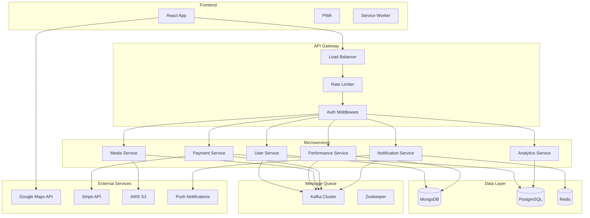

# 🏗️ StreetPerformersMap - Technical Architecture Document

## 📋 Table of Contents
1. [Architecture Overview](#architecture-overview)
2. [Technology Stack](#technology-stack)
3. [System Design](#system-design)
4. [Database Design](#database-design)
5. [Microservices Architecture](#microservices-architecture)
6. [Real-time Communication](#real-time-communication)
7. [Security Architecture](#security-architecture)
8. [Scalability & Performance](#scalability--performance)
9. [DevOps & Infrastructure](#devops--infrastructure)
10. [Trade-offs & Decisions](#trade-offs--decisions)

---

## 🏛️ Architecture Overview

StreetPerformersMap follows a **modern microservices architecture** with **event-driven communication**, **real-time updates**, and **cloud-native deployment**. The system is designed for high availability, scalability, and performance.

```
┌─────────────────────────────────────────────────────────────────┐
│                   StreetPerformersMap Architecture              │
└─────────────────────────────────────────────────────────────────┘

┌─────────────┐    ┌─────────────┐    ┌─────────────┐    ┌─────────────┐
│   Frontend  │    │   API       │    │ Kubernetes  │    │  External   │
│   (React)   │    │  Gateway    │    │   Cluster   │    │  Services   │
└─────────────┘    └─────────────┘    └─────────────┘    └─────────────┘
       │                   │                   │                   │
       │ HTTPS/WSS         │                   │                   │
       │                   │                   │                   │
       │◄──────────────────┤                   │                   │
       │                   │                   │                   │
       │                   │ gRPC/HTTP         │                   │
       │                   ├──────────────────►│                   │
       │                   │                   │                   │
       │                   │                   │ HTTP/gRPC         │
       │                   │                   ├──────────────────►│
       │                   │                   │                   │
       │                   │                   │ ┌─────────────┐   │
       │                   │                   │ │   User      │   │
       │                   │                   │ │  Service    │   │
       │                   │                   │ └─────────────┘   │
       │                   │                   │ ┌─────────────┐   │
       │                   │                   │ │Performance  │   │
       │                   │                   │ │  Service    │   │
       │                   │                   │ └─────────────┘   │
       │                   │                   │ ┌─────────────┐   │
       │                   │                   │ │   Media     │   │
       │                   │                   │ │  Service    │   │
       │                   │                   │ └─────────────┘   │
       │                   │                   │ ┌─────────────┐   │
       │                   │                   │ │  Payment    │   │
       │                   │                   │ │  Service    │   │
       │                   │                   │ └─────────────┘   │
       │                   │                   │ ┌─────────────┐   │
       │                   │                   │ │Notification │   │
       │                   │                   │ │  Service    │   │
       │                   │                   │ └─────────────┘   │
```

---

## 💻 Technology Stack

### **Frontend Stack**

```typescript
// Core Technologies
- React 18+ (with Concurrent Features)
- TypeScript 5+ (Type Safety)
- TanStack Router (Type-safe Routing)
- Zustand (State Management)
- Shadcn/ui (UI Components)
- Tailwind CSS (Styling)

// Maps & Location
- React Google Maps (@vis.gl/react-google-maps)
- Google Maps JavaScript API
- Geolocation API

// Real-time & Communication
- Socket.io Client (WebSocket)
- React Query (Server State)
- Axios (HTTP Client)

// Media & Performance
- React Player (Video Playback)
- React Intersection Observer (Performance)
- React Virtual (List Virtualization)

// Build & Development
- Vite (Build Tool)
- ESLint + Prettier (Code Quality)
- Vitest (Testing)
- Storybook (Component Development)
```

### **Backend Stack**

```typescript
// Core Technologies
- Node.js 20+ (Runtime)
- TypeScript 5+ (Language)
- Express.js (Web Framework)
- Domain-Driven Design (Architecture)

// Database & Storage
- MongoDB (Content & User Data)
- PostgreSQL (Transactions & Analytics)
- Redis (Caching & Sessions)
- AWS S3 (Video Storage)

// Message Queue & Events
- Apache Kafka (Event Streaming)
- Kafka Connect (Data Integration)
- Schema Registry (Event Schemas)

// Real-time Communication
- Socket.io (WebSocket Server)
- Redis Adapter (Socket Scaling)

// Authentication & Security
- JWT (Authentication)
- Passport.js (Auth Strategies)
- Helmet.js (Security Headers)
- Rate Limiting (DDoS Protection)

// Monitoring & Logging
- Winston (Logging)
- Prometheus (Metrics)
- Jaeger (Distributed Tracing)
```

### **Infrastructure Stack**

```yaml
# Container & Orchestration
- Docker (Containerization)
- Kubernetes (Orchestration)
- Helm (Package Management)
- Istio (Service Mesh)

# Cloud Services (AWS)
- EKS (Kubernetes Service)
- RDS (PostgreSQL)
- DocumentDB (MongoDB Compatible)
- ElastiCache (Redis)
- S3 (Object Storage)
- CloudFront (CDN)
- Route 53 (DNS)

# CI/CD & DevOps
- GitHub Actions (CI/CD)
- ArgoCD (GitOps)
- Terraform (Infrastructure as Code)
- Vault (Secrets Management)

# Monitoring & Observability
- Prometheus + Grafana (Metrics)
- ELK Stack (Logging)
- Jaeger (Tracing)
- AlertManager (Alerting)
```

---

## 🎯 System Design

### **High-Level Architecture**



### **Domain-Driven Design Structure**

```
src/
├── domains/
│   ├── user/
│   │   ├── entities/
│   │   │   ├── User.ts
│   │   │   └── UserProfile.ts
│   │   ├── repositories/
│   │   │   └── UserRepository.ts
│   │   ├── services/
│   │   │   ├── UserService.ts
│   │   │   └── AuthService.ts
│   │   ├── controllers/
│   │   │   └── UserController.ts
│   │   └── routes/
│   │       └── userRoutes.ts
│   ├── performance/
│   │   ├── entities/
│   │   │   ├── Performance.ts
│   │   │   ├── Route.ts
│   │   │   └── Location.ts
│   │   ├── repositories/
│   │   │   └── PerformanceRepository.ts
│   │   ├── services/
│   │   │   ├── PerformanceService.ts
│   │   │   └── RouteService.ts
│   │   └── controllers/
│   │       └── PerformanceController.ts
│   ├── media/
│   │   ├── entities/
│   │   │   └── Video.ts
│   │   ├── services/
│   │   │   ├── VideoService.ts
│   │   │   └── StorageService.ts
│   │   └── controllers/
│   │       └── MediaController.ts
│   └── payment/
│       ├── entities/
│       │   ├── Transaction.ts
│       │   └── Tip.ts
│       ├── services/
│       │   ├── PaymentService.ts
│       │   └── StripeService.ts
│       └── controllers/
│           └── PaymentController.ts
├── shared/
│   ├── infrastructure/
│   │   ├── database/
│   │   ├── messaging/
│   │   └── storage/
│   ├── middleware/
│   └── utils/
└── app.ts
```

---

## 🗄️ Database Design

### **MongoDB Collections (Content & User Data)**

```typescript
// Users Collection
interface User {
  _id: ObjectId;
  email: string;
  username: string;
  role: 'performer' | 'audience';
  profile: {
    displayName: string;
    bio?: string;
    avatar?: string;
    genres?: string[];
    socialLinks?: {
      instagram?: string;
      spotify?: string;
      youtube?: string;
    };
  };
  location: {
    city: string;
    country: string;
    coordinates: [number, number]; // [lng, lat]
  };
  preferences: {
    notifications: boolean;
    genres: string[];
    radius: number; // km
  };
  statistics: {
    totalLikes: number;
    totalTips: number;
    performanceCount: number;
  };
  createdAt: Date;
  updatedAt: Date;
}

// Performances Collection
interface Performance {
  _id: ObjectId;
  performerId: ObjectId;
  title: string;
  description?: string;
  genre: string;
  route: {
    stops: Array<{
      location: {
        coordinates: [number, number];
        address: string;
        name?: string;
      };
      startTime: Date;
      endTime: Date;
      status: 'scheduled' | 'active' | 'completed' | 'cancelled';
    }>;
  };
  videos: Array<{
    url: string;
    thumbnail: string;
    duration: number;
    uploadedAt: Date;
  }>;
  engagement: {
    likes: number;
    views: number;
    tips: number;
    likedBy: ObjectId[];
  };
  status: 'scheduled' | 'live' | 'completed' | 'cancelled';
  scheduledFor: Date;
  createdAt: Date;
  expiresAt: Date; // Auto-delete after 24 hours
}

// Stories Collection (for trending content)
interface Story {
  _id: ObjectId;
  performerId: ObjectId;
  performanceId: ObjectId;
  videoUrl: string;
  thumbnail: string;
  views: number;
  expiresAt: Date; // 24 hour expiry
  createdAt: Date;
}
```

### **PostgreSQL Tables (Transactions & Analytics)**

```sql
-- Transactions Table
CREATE TABLE transactions (
    id UUID PRIMARY KEY DEFAULT gen_random_uuid(),
    user_id VARCHAR(24) NOT NULL, -- MongoDB ObjectId
    performer_id VARCHAR(24) NOT NULL,
    performance_id VARCHAR(24),
    amount DECIMAL(10,2) NOT NULL,
    currency VARCHAR(3) DEFAULT 'EUR',
    payment_method VARCHAR(50), -- 'stripe', 'bizum'
    stripe_payment_intent_id VARCHAR(255),
    status VARCHAR(20) NOT NULL, -- 'pending', 'completed', 'failed', 'refunded'
    metadata JSONB,
    created_at TIMESTAMP DEFAULT CURRENT_TIMESTAMP,
    updated_at TIMESTAMP DEFAULT CURRENT_TIMESTAMP
);

-- Analytics Events Table
CREATE TABLE analytics_events (
    id UUID PRIMARY KEY DEFAULT gen_random_uuid(),
    event_type VARCHAR(50) NOT NULL, -- 'video_view', 'like', 'tip', 'performance_start'
    user_id VARCHAR(24),
    performer_id VARCHAR(24),
    performance_id VARCHAR(24),
    properties JSONB,
    location POINT, -- PostGIS for location analytics
    created_at TIMESTAMP DEFAULT CURRENT_TIMESTAMP
);

-- Performance Analytics Aggregations
CREATE TABLE performance_analytics (
    id UUID PRIMARY KEY DEFAULT gen_random_uuid(),
    performance_id VARCHAR(24) NOT NULL,
    date DATE NOT NULL,
    views INTEGER DEFAULT 0,
    likes INTEGER DEFAULT 0,
    tips_count INTEGER DEFAULT 0,
    tips_amount DECIMAL(10,2) DEFAULT 0,
    unique_viewers INTEGER DEFAULT 0,
    engagement_rate DECIMAL(5,4),
    created_at TIMESTAMP DEFAULT CURRENT_TIMESTAMP,
    UNIQUE(performance_id, date)
);

-- Indexes for Performance
CREATE INDEX idx_transactions_user_id ON transactions(user_id);
CREATE INDEX idx_transactions_performer_id ON transactions(performer_id);
CREATE INDEX idx_transactions_created_at ON transactions(created_at);
CREATE INDEX idx_analytics_events_type_created ON analytics_events(event_type, created_at);
CREATE INDEX idx_analytics_events_location ON analytics_events USING GIST(location);
```

---

## 🔧 Microservices Architecture

### **Service Breakdown**

#### **1. User Service**
```typescript
// Responsibilities
- User registration and authentication
- Profile management
- User preferences and settings
- Follow/unfollow functionality

// API Endpoints
POST   /api/users/register
POST   /api/users/login
GET    /api/users/profile
PUT    /api/users/profile
POST   /api/users/:id/follow
DELETE /api/users/:id/follow

// Events Published
- UserRegistered
- UserProfileUpdated
- UserFollowed
- UserUnfollowed
```

#### **2. Performance Service**
```typescript
// Responsibilities
- Performance creation and management
- Route planning and scheduling
- Real-time performance status
- Performance discovery and search

// API Endpoints
POST   /api/performances
GET    /api/performances/nearby
GET    /api/performances/:id
PUT    /api/performances/:id
DELETE /api/performances/:id
POST   /api/performances/:id/like
GET    /api/performances/search

// Events Published
- PerformanceCreated
- PerformanceStarted
- PerformanceEnded
- PerformanceLiked
- PerformanceLocationUpdated
```

#### **3. Media Service**
```typescript
// Responsibilities
- Video upload and processing
- Video streaming and delivery
- Thumbnail generation
- Content moderation

// API Endpoints
POST   /api/media/upload
GET    /api/media/:id
DELETE /api/media/:id
GET    /api/media/:id/stream

// Events Published
- VideoUploaded
- VideoProcessed
- VideoDeleted
```

#### **4. Payment Service**
```typescript
// Responsibilities
- Tip processing
- Payment method management
- Transaction history
- Payout management

// API Endpoints
POST   /api/payments/tip
GET    /api/payments/methods
POST   /api/payments/methods
GET    /api/payments/transactions
POST   /api/payments/payout

// Events Published
- TipReceived
- PaymentProcessed
- PayoutCompleted
```

#### **5. Notification Service**
```typescript
// Responsibilities
- Push notifications
- Email notifications
- Real-time updates via WebSocket
- Notification preferences

// API Endpoints
POST   /api/notifications/send
GET    /api/notifications/settings
PUT    /api/notifications/settings

// Events Consumed
- PerformanceStarted
- TipReceived
- UserFollowed
- PerformanceLiked
```

---

## ⚡ Real-time Communication

### **WebSocket Architecture**

```typescript
// WebSocket Events
interface WebSocketEvents {
  // Client to Server
  'join-room': { performanceId: string };
  'leave-room': { performanceId: string };
  'performance-update': { performanceId: string; status: string };
  'like-performance': { performanceId: string };
  
  // Server to Client
  'performance-started': { performance: Performance };
  'performance-ended': { performanceId: string };
  'new-like': { performanceId: string; totalLikes: number };
  'viewer-count': { performanceId: string; count: number };
  'location-update': { performanceId: string; location: Coordinates };
}

// Real-time Map Updates
class MapUpdateService {
  private io: SocketServer;
  private redis: RedisClient;
  
  async broadcastPerformanceUpdate(performance: Performance) {
    // Broadcast to users in the same city
    const room = `city-${performance.location.city}`;
    this.io.to(room).emit('performance-update', {
      id: performance._id,
      status: performance.status,
      location: performance.currentLocation,
      likes: performance.engagement.likes
    });
    
    // Update cached data
    await this.redis.setex(
      `performance:${performance._id}`,
      300, // 5 minutes
      JSON.stringify(performance)
    );
  }
}
```

### **Kafka Event Streaming**

```typescript
// Kafka Topics
const KAFKA_TOPICS = {
  PERFORMANCE_EVENTS: 'performance-events',
  USER_EVENTS: 'user-events',
  PAYMENT_EVENTS: 'payment-events',
  NOTIFICATION_EVENTS: 'notification-events',
  ANALYTICS_EVENTS: 'analytics-events'
};

// Event Schemas
interface PerformanceStartedEvent {
  type: 'PERFORMANCE_STARTED';
  performanceId: string;
  performerId: string;
  location: {
    coordinates: [number, number];
    city: string;
  };
  timestamp: string;
}

interface TipReceivedEvent {
  type: 'TIP_RECEIVED';
  transactionId: string;
  performerId: string;
  amount: number;
  currency: string;
  timestamp: string;
}

// Event Handlers
class EventHandler {
  async handlePerformanceStarted(event: PerformanceStartedEvent) {
    // Update performance status in database
    await this.performanceService.updateStatus(event.performanceId, 'live');
    
    // Notify followers
    await this.notificationService.notifyFollowers(event.performerId, {
      type: 'performance_started',
      performanceId: event.performanceId
    });
    
    // Broadcast real-time update
    await this.webSocketService.broadcastToCity(event.location.city, {
      type: 'performance-started',
      performance: event
    });
  }
}
```

---

## 🔐 Security Architecture

### **Authentication & Authorization**

```typescript
// JWT Token Structure
interface JWTPayload {
  sub: string; // user ID
  email: string;
  role: 'performer' | 'audience';
  permissions: string[];
  iat: number;
  exp: number;
}

// Role-Based Access Control
const PERMISSIONS = {
  PERFORMER: [
    'create:performance',
    'update:own-performance',
    'delete:own-performance',
    'upload:video',
    'view:analytics'
  ],
  AUDIENCE: [
    'view:performances',
    'like:performance',
    'tip:performer'
  ]
};

// API Security Middleware
class SecurityMiddleware {
  async authenticate(req: Request, res: Response, next: NextFunction) {
    const token = req.headers.authorization?.replace('Bearer ', '');
    if (!token) {
      return res.status(401).json({ error: 'No token provided' });
    }
    
    try {
      const payload = jwt.verify(token, process.env.JWT_SECRET) as JWTPayload;
      req.user = payload;
      next();
    } catch (error) {
      return res.status(401).json({ error: 'Invalid token' });
    }
  }
  
  authorize(permission: string) {
    return (req: Request, res: Response, next: NextFunction) => {
      if (!req.user?.permissions.includes(permission)) {
        return res.status(403).json({ error: 'Insufficient permissions' });
      }
      next();
    };
  }
}
```

### **Data Protection**

```typescript
// Input Validation
import Joi from 'joi';

const performanceSchema = Joi.object({
  title: Joi.string().min(1).max(100).required(),
  description: Joi.string().max(500),
  genre: Joi.string().valid('rock', 'jazz', 'folk', 'pop', 'classical').required(),
  route: Joi.object({
    stops: Joi.array().items(
      Joi.object({
        location: Joi.object({
          coordinates: Joi.array().items(Joi.number()).length(2).required(),
          address: Joi.string().required()
        }).required(),
        startTime: Joi.date().iso().required(),
        endTime: Joi.date().iso().greater(Joi.ref('startTime')).required()
      })
    ).min(1).max(5).required()
  }).required()
});

// Rate Limiting
const rateLimitConfig = {
  windowMs: 15 * 60 * 1000, // 15 minutes
  max: 100, // limit each IP to 100 requests per windowMs
  message: 'Too many requests from this IP',
  standardHeaders: true,
  legacyHeaders: false,
};
```

---

## 📈 Scalability & Performance

### **Auto-scaling Configuration**

```yaml
# Kubernetes HPA Configuration
apiVersion: autoscaling/v2
kind: HorizontalPodAutoscaler
metadata:
  name: performance-service-hpa
spec:
  scaleTargetRef:
    apiVersion: apps/v1
    kind: Deployment
    name: performance-service
  minReplicas: 2
  maxReplicas: 20
  metrics:
  - type: Resource
    resource:
      name: cpu
      target:
        type: Utilization
        averageUtilization: 70
  - type: Resource
    resource:
      name: memory
      target:
        type: Utilization
        averageUtilization: 80
  behavior:
    scaleUp:
      stabilizationWindowSeconds: 60
      policies:
      - type: Percent
        value: 100
        periodSeconds: 15
    scaleDown:
      stabilizationWindowSeconds: 300
      policies:
      - type: Percent
        value: 10
        periodSeconds: 60
```

### **Caching Strategy**

```typescript
// Multi-layer Caching
class CacheService {
  private redis: RedisClient;
  private localCache: NodeCache;
  
  async get(key: string): Promise<any> {
    // L1: Local cache (fastest)
    const localValue = this.localCache.get(key);
    if (localValue) return localValue;
    
    // L2: Redis cache (fast)
    const redisValue = await this.redis.get(key);
    if (redisValue) {
      this.localCache.set(key, JSON.parse(redisValue), 60); // 1 minute local cache
      return JSON.parse(redisValue);
    }
    
    return null;
  }
  
  async set(key: string, value: any, ttl: number = 300) {
    // Set in both caches
    this.localCache.set(key, value, Math.min(ttl, 300));
    await this.redis.setex(key, ttl, JSON.stringify(value));
  }
}

// Performance-specific caching
const CACHE_KEYS = {
  NEARBY_PERFORMANCES: (lat: number, lng: number, radius: number) => 
    `performances:nearby:${lat}:${lng}:${radius}`,
  TRENDING_PERFORMERS: (city: string) => `performers:trending:${city}`,
  USER_FEED: (userId: string) => `feed:${userId}`
};
```

### **Database Optimization**

```typescript
// MongoDB Indexes
db.performances.createIndex(
  { 
    "route.stops.location.coordinates": "2dsphere",
    "status": 1,
    "scheduledFor": 1 
  },
  { name: "location_status_time_idx" }
);

db.performances.createIndex(
  { "performerId": 1, "createdAt": -1 },
  { name: "performer_created_idx" }
);

db.performances.createIndex(
  { "expiresAt": 1 },
  { expireAfterSeconds: 0, name: "ttl_idx" }
);

// PostgreSQL Query Optimization
-- Materialized view for performance analytics
CREATE MATERIALIZED VIEW performance_stats AS
SELECT 
    performer_id,
    DATE_TRUNC('day', created_at) as date,
    COUNT(*) as total_performances,
    SUM(tips_amount) as total_tips,
    AVG(engagement_rate) as avg_engagement
FROM performance_analytics
GROUP BY performer_id, DATE_TRUNC('day', created_at);

-- Refresh strategy
CREATE OR REPLACE FUNCTION refresh_performance_stats()
RETURNS void AS $$
BEGIN
    REFRESH MATERIALIZED VIEW CONCURRENTLY performance_stats;
END;
$$ LANGUAGE plpgsql;
```

---

## 🚀 DevOps & Infrastructure

### **CI/CD Pipeline**

```yaml
# .github/workflows/deploy.yml
name: Deploy to Production

on:
  push:
    branches: [main]

jobs:
  test:
    runs-on: ubuntu-latest
    steps:
      - uses: actions/checkout@v3
      - uses: actions/setup-node@v3
        with:
          node-version: '20'
      - run: npm ci
      - run: npm run test:unit
      - run: npm run test:integration
      - run: npm run lint
      - run: npm run type-check

  build:
    needs: test
    runs-on: ubuntu-latest
    steps:
      - uses: actions/checkout@v3
      - name: Build and push Docker images
        run: |
          docker build -t streetperformers/api:${{ github.sha }} ./backend
          docker build -t streetperformers/frontend:${{ github.sha }} ./frontend
          docker push streetperformers/api:${{ github.sha }}
          docker push streetperformers/frontend:${{ github.sha }}

  deploy:
    needs: build
    runs-on: ubuntu-latest
    steps:
      - name: Deploy to Kubernetes
        run: |
          kubectl set image deployment/api api=streetperformers/api:${{ github.sha }}
          kubectl set image deployment/frontend frontend=streetperformers/frontend:${{ github.sha }}
          kubectl rollout status deployment/api
          kubectl rollout status deployment/frontend
```

### **Infrastructure as Code**

```hcl
# terraform/main.tf
resource "aws_eks_cluster" "streetperformers" {
  name     = "streetperformers-cluster"
  role_arn = aws_iam_role.cluster.arn
  version  = "1.27"

  vpc_config {
    subnet_ids = [
      aws_subnet.private_a.id,
      aws_subnet.private_b.id,
      aws_subnet.public_a.id,
      aws_subnet.public_b.id,
    ]
    endpoint_private_access = true
    endpoint_public_access  = true
  }

  enabled_cluster_log_types = ["api", "audit", "authenticator", "controllerManager", "scheduler"]

  depends_on = [
    aws_iam_role_policy_attachment.cluster_AmazonEKSClusterPolicy,
  ]
}

resource "aws_rds_cluster" "postgresql" {
  cluster_identifier      = "streetperformers-postgres"
  engine                 = "aurora-postgresql"
  engine_version         = "13.7"
  database_name          = "streetperformers"
  master_username        = var.db_username
  master_password        = var.db_password
  backup_retention_period = 5
  preferred_backup_window = "07:00-09:00"
  skip_final_snapshot    = false
  
  vpc_security_group_ids = [aws_security_group.rds.id]
  db_subnet_group_name   = aws_db_subnet_group.default.name
}
```

---

## ⚖️ Trade-offs & Decisions

### **Technology Choices**

#### **Frontend: React vs Vue vs Angular**
**Choice: React**
- ✅ **Pros**: Largest ecosystem, excellent TypeScript support, great performance with concurrent features
- ❌ **Cons**: Steeper learning curve, more boilerplate
- **Decision**: React's ecosystem and performance benefits outweigh complexity

#### **State Management: Zustand vs Redux Toolkit vs Jotai**
**Choice: Zustand**
- ✅ **Pros**: Minimal boilerplate, excellent TypeScript support, small bundle size
- ❌ **Cons**: Less mature ecosystem than Redux
- **Decision**: Simplicity and performance are more important than ecosystem size

#### **Routing: TanStack Router vs React Router**
**Choice: TanStack Router**
- ✅ **Pros**: Type-safe routing, excellent developer experience, built-in code splitting
- ❌ **Cons**: Newer, smaller community
- **Decision**: Type safety and developer experience justify the choice

#### **Backend: Node.js vs Go vs Python**
**Choice: Node.js**
- ✅ **Pros**: JavaScript ecosystem, real-time capabilities, fast development
- ❌ **Cons**: Single-threaded, memory usage
- **Decision**: Development speed and real-time features are priorities

#### **Database: MongoDB vs PostgreSQL**
**Choice: Hybrid (MongoDB + PostgreSQL)**
- **MongoDB**: User profiles, performances, content (flexible schema)
- **PostgreSQL**: Transactions, analytics (ACID compliance)
- **Decision**: Use the right tool for each use case

#### **Message Queue: Kafka vs RabbitMQ vs Redis Streams**
**Choice: Apache Kafka**
- ✅ **Pros**: High throughput, durability, scalability, event sourcing
- ❌ **Cons**: Complex setup, resource intensive
- **Decision**: Scalability and event sourcing capabilities justify complexity

### **Architecture Trade-offs**

#### **Microservices vs Monolith**
**Choice: Microservices**
- ✅ **Pros**: Independent scaling, technology diversity, fault isolation
- ❌ **Cons**: Distributed system complexity, network overhead
- **Decision**: Scalability requirements and team structure favor microservices

#### **Synchronous vs Asynchronous Communication**
**Choice: Hybrid**
- **Synchronous**: User-facing operations (immediate feedback)
- **Asynchronous**: Background processing, analytics, notifications
- **Decision**: Balance user experience with system scalability

#### **SQL vs NoSQL**
**Choice: Polyglot Persistence**
- **MongoDB**: Flexible content and user data
- **PostgreSQL**: Structured financial and analytics data
- **Redis**: Caching and session storage
- **Decision**: Use each database for its strengths

### **Performance vs Complexity Trade-offs**

#### **Real-time Updates**
- **Trade-off**: WebSocket complexity vs user experience
- **Decision**: Real-time experience is core to the product

#### **Caching Strategy**
- **Trade-off**: Cache complexity vs performance
- **Decision**: Multi-layer caching for optimal performance

#### **Auto-scaling**
- **Trade-off**: Infrastructure complexity vs cost optimization
- **Decision**: Auto-scaling essential for variable traffic patterns

---

## 📊 Monitoring & Observability

```typescript
// Metrics Collection
const prometheus = require('prom-client');

const httpRequestDuration = new prometheus.Histogram({
  name: 'http_request_duration_seconds',
  help: 'Duration of HTTP requests in seconds',
  labelNames: ['method', 'route', 'status_code']
});

const activePerformances = new prometheus.Gauge({
  name: 'active_performances_total',
  help: 'Number of currently active performances'
});

// Health Checks
app.get('/health', async (req, res) => {
  const health = {
    status: 'ok',
    timestamp: new Date().toISOString(),
    services: {
      database: await checkDatabase(),
      redis: await checkRedis(),
      kafka: await checkKafka()
    }
  };
  
  const isHealthy = Object.values(health.services).every(service => service === 'ok');
  res.status(isHealthy ? 200 : 503).json(health);
});
```

---

This technical architecture provides a solid foundation for building a scalable, performant, and maintainable StreetPerformersMap platform. The combination of modern technologies, microservices architecture, and cloud-native deployment ensures the system can handle growth while maintaining excellent user experience.

---

*Next: Task Master Document with detailed implementation breakdown*
