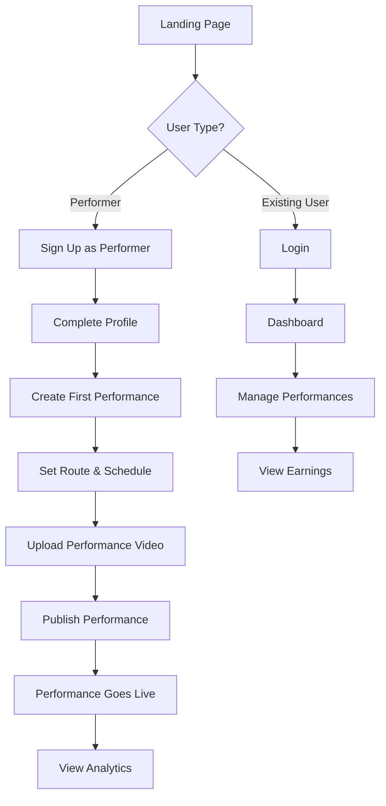
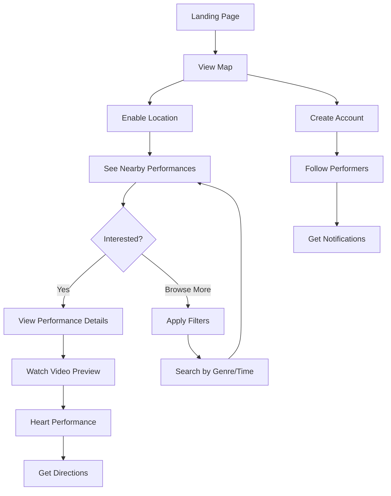

# 🎨 StreetPerformersMap - UI Mockups & Wireframes

## 📋 Table of Contents
1. [Design System Overview](#design-system-overview)
2. [User Flow Diagrams](#user-flow-diagrams)
3. [Authentication Screens](#authentication-screens)
4. [Map & Discovery](#map--discovery)
5. [Performance Management](#performance-management)
6. [User Profiles](#user-profiles)
7. [Mobile Responsive Design](#mobile-responsive-design)
8. [Component Library](#component-library)

---

## 🎯 Design System Overview

### **Color Palette**
```css
/* Primary Colors */
--primary-purple: #8B5CF6;    /* Main brand color */
--primary-purple-dark: #7C3AED;
--primary-purple-light: #A78BFA;

/* Secondary Colors */
--secondary-orange: #F59E0B;   /* Performance markers, CTAs */
--secondary-orange-dark: #D97706;
--secondary-orange-light: #FCD34D;

/* Neutral Colors */
--gray-900: #111827;    /* Text primary */
--gray-700: #374151;    /* Text secondary */
--gray-500: #6B7280;    /* Text muted */
--gray-300: #D1D5DB;    /* Borders */
--gray-100: #F3F4F6;    /* Background light */
--white: #FFFFFF;

/* Status Colors */
--success: #10B981;     /* Live performances */
--warning: #F59E0B;     /* Starting soon */
--error: #EF4444;       /* Cancelled */
--info: #3B82F6;        /* Scheduled */
```

### **Typography**
```css
/* Font Family */
font-family: 'Inter', -apple-system, BlinkMacSystemFont, sans-serif;

/* Font Sizes */
--text-xs: 0.75rem;     /* 12px */
--text-sm: 0.875rem;    /* 14px */
--text-base: 1rem;      /* 16px */
--text-lg: 1.125rem;    /* 18px */
--text-xl: 1.25rem;     /* 20px */
--text-2xl: 1.5rem;     /* 24px */
--text-3xl: 1.875rem;   /* 30px */
--text-4xl: 2.25rem;    /* 36px */

/* Font Weights */
--font-normal: 400;
--font-medium: 500;
--font-semibold: 600;
--font-bold: 700;
```

### **Spacing & Layout**
```css
/* Spacing Scale */
--space-1: 0.25rem;   /* 4px */
--space-2: 0.5rem;    /* 8px */
--space-3: 0.75rem;   /* 12px */
--space-4: 1rem;      /* 16px */
--space-6: 1.5rem;    /* 24px */
--space-8: 2rem;      /* 32px */
--space-12: 3rem;     /* 48px */

/* Border Radius */
--radius-sm: 0.25rem;   /* 4px */
--radius-md: 0.375rem;  /* 6px */
--radius-lg: 0.5rem;    /* 8px */
--radius-xl: 0.75rem;   /* 12px */
```

---

## 🔄 User Flow Diagrams

### **Performer User Flow**


### **Audience User Flow**


---

## 🔐 Authentication Screens

### **Landing Page**
```
┌─────────────────────────────────────────────────────────────┐
│ [🎵 StreetPerformersMap]                    [Login] [Sign Up] │
├─────────────────────────────────────────────────────────────┤
│                                                             │
│           🎸 Discover Live Street Music Around You 🎸       │
│                                                             │
│        Connect performers with audiences in real-time       │
│                                                             │
│  ┌─────────────────┐  ┌─────────────────┐  ┌──────────────┐ │
│  │   🎭 For        │  │   👥 For        │  │   🗺️ Explore │ │
│  │  Performers     │  │  Music Lovers   │  │    Map       │ │
│  │                 │  │                 │  │              │ │
│  │ • Set your route│  │ • Find live     │  │ See what's   │ │
│  │ • Upload videos │  │   performances  │  │ happening    │ │
│  │ • Build audience│  │ • Support       │  │ right now    │ │
│  │                 │  │   artists       │  │              │ │
│  │ [Get Started]   │  │ [Discover Music]│  │ [View Map]   │ │
│  └─────────────────┘  └─────────────────┘  └──────────────┘ │
│                                                             │
│                    🌟 Featured Today 🌟                     │
│  ┌─────────────────────────────────────────────────────────┐ │
│  │ [📍 Central Park] Jazz Trio - Live Now! 🔴 127 ❤️      │ │
│  │ [📍 Times Square] Street Guitar - Starting in 15min    │ │
│  │ [📍 Brooklyn Bridge] Folk Singer - 2:30 PM Today       │ │
│  └─────────────────────────────────────────────────────────┘ │
└─────────────────────────────────────────────────────────────┘
```

### **Sign Up Modal**
```
┌─────────────────────────────────────────────────────────────┐
│                     Join StreetPerformersMap                │
├─────────────────────────────────────────────────────────────┤
│                                                             │
│  I want to:                                                 │
│  ┌─────────────────┐  ┌─────────────────┐                  │
│  │ 🎭 PERFORM      │  │ 👥 DISCOVER     │                  │
│  │                 │  │                 │                  │
│  │ Share my music  │  │ Find live music │                  │
│  │ Build audience  │  │ Support artists │                  │
│  │ Earn tips       │  │ Explore city    │                  │
│  │                 │  │                 │                  │
│  │ [I'm a Musician]│  │ [I'm a Fan]     │                  │
│  └─────────────────┘  └─────────────────┘                  │
│                                                             │
│  ────────────── OR ──────────────                          │
│                                                             │
│  📧 Email:    [________________________]                   │
│  🔒 Password: [________________________]                   │
│  👤 Username: [________________________]                   │
│                                                             │
│  ☐ I agree to Terms of Service and Privacy Policy          │
│                                                             │
│                    [Create Account]                         │
│                                                             │
│              Already have an account? [Sign In]             │
└─────────────────────────────────────────────────────────────┘
```

### **Login Modal**
```
┌─────────────────────────────────────────────────────────────┐
│                        Welcome Back!                        │
├─────────────────────────────────────────────────────────────┤
│                                                             │
│  📧 Email:    [________________________]                   │
│  🔒 Password: [________________________]                   │
│                                                             │
│  ☐ Remember me                      [Forgot Password?]      │
│                                                             │
│                      [Sign In]                              │
│                                                             │
│  ────────────── OR ──────────────                          │
│                                                             │
│  [🔵 Continue with Google]                                  │
│  [📱 Continue with Apple]                                   │
│                                                             │
│                Don't have an account? [Sign Up]             │
└─────────────────────────────────────────────────────────────┘
```

---

## 🗺️ Map & Discovery

### **Main Map Interface**
```
┌─────────────────────────────────────────────────────────────┐
│ [🎵] [Search performances...] [🔍] [📍] [👤] [☰]           │
├─────────────────────────────────────────────────────────────┤
│ 🎭 Filters: [All Genres ▼] [Now ▼] [5km ▼] [Clear]        │
├─────────────────────────────────────────────────────────────┤
│                                                             │
│                    🗺️ INTERACTIVE MAP                       │
│                                                             │
│        📍 You are here                                      │
│                                                             │
│    🔴 Jazz Trio (Live) - 127 ❤️                           │
│         Central Park                                        │
│                                                             │
│              🟡 Street Guitar (15min)                      │
│                  Times Square                               │
│                                                             │
│                      🔵 Folk Singer (2:30 PM)             │
│                        Brooklyn Bridge                      │
│                                                             │
│  🟢 Rock Band (3:00 PM)                                   │
│      Washington Square                                      │
│                                                             │
│                                 🟣 Violin Solo (4:00 PM)   │
│                                    High Line               │
│                                                             │
├─────────────────────────────────────────────────────────────┤
│ 📱 Bottom Sheet (swipe up for list view)                   │
│ ┌─────────────────────────────────────────────────────────┐ │
│ │ 🔴 LIVE NOW • Jazz Trio at Central Park                │ │
│ │ [▶️ Watch] 127 ❤️ • 2.3km away • Ends at 3:30 PM      │ │
│ └─────────────────────────────────────────────────────────┘ │
└─────────────────────────────────────────────────────────────┘

Legend:
🔴 Live Now    🟡 Starting Soon    🔵 Scheduled    🟢 Later Today    🟣 Tomorrow
Size = Popularity (hearts received)
```

### **Performance Detail Modal**
```
┌─────────────────────────────────────────────────────────────┐
│                              [✕]                            │
│ ┌─────────────────────────────────────────────────────────┐ │
│ │                                                         │ │
│ │                🎥 VIDEO PREVIEW                         │ │
│ │                 (30 seconds)                            │ │
│ │                                                         │ │
│ │               ▶️  [    ●●●●●●●    ]                     │ │
│ └─────────────────────────────────────────────────────────┘ │
│                                                             │
│ 🎭 **Jazz Trio** • 🎵 Jazz                                 │
│ 📍 Central Park, Bethesda Fountain                         │
│ ⏰ Live Now • Ends at 3:30 PM                              │
│                                                             │
│ 👥 127 people are interested ❤️                            │
│                                                             │
│ 📝 "Smooth jazz classics and modern interpretations.       │
│     Come enjoy the music by the fountain!"                 │
│                                                             │
│ 🎼 Next stops on route:                                     │
│ • 4:00 PM - Sheep Meadow (500m away)                       │
│ • 5:30 PM - Strawberry Fields (300m away)                  │
│                                                             │
│ ┌─────────────────┐ ┌─────────────────┐ ┌──────────────┐  │
│ │ ❤️ Interested   │ │ 🧭 Get          │ │ 👤 Follow    │  │
│ │   (127)         │ │   Directions    │ │   Artist     │  │
│ └─────────────────┘ └─────────────────┘ └──────────────┘  │
│                                                             │
│ 🎤 About the Artist:                                        │
│ Mike's Jazz Collective - Performing in NYC for 5 years     │
│ 🔗 @mikesjazz | 🎵 spotify.com/mikesjazz                   │
└─────────────────────────────────────────────────────────────┘
```

### **Filter & Search Interface**
```
┌─────────────────────────────────────────────────────────────┐
│                     🔍 Find Performances                     │
├─────────────────────────────────────────────────────────────┤
│                                                             │
│ 🎵 Genre                                                    │
│ ┌─────┐ ┌─────┐ ┌─────┐ ┌─────┐ ┌─────┐ ┌─────┐           │
│ │ All │ │Jazz │ │Rock │ │Folk │ │Pop  │ │More▼│           │
│ └─────┘ └─────┘ └─────┘ └─────┘ └─────┘ └─────┘           │
│                                                             │
│ ⏰ Time                                                     │
│ ┌─────────┐ ┌─────────┐ ┌─────────┐ ┌─────────┐            │
│ │ Now     │ │ 1 Hour  │ │ Today   │ │ Custom  │            │
│ └─────────┘ └─────────┘ └─────────┘ └─────────┘            │
│                                                             │
│ 📍 Distance                                                 │
│ ┌─────┐ ┌─────┐ ┌─────┐ ┌─────┐                            │
│ │ 1km │ │ 5km │ │10km │ │25km │                            │
│ └─────┘ └─────┘ └─────┘ └─────┘                            │
│                                                             │
│ 🔥 Popularity                                               │
│ ┌─────────┐ ┌─────────┐ ┌─────────┐                        │
│ │ Trending│ │ Popular │ │ New     │                        │
│ └─────────┘ └─────────┘ └─────────┘                        │
│                                                             │
│ ────────────────────────────────────────────────            │
│                                                             │
│ 📋 **5 performances found**                                 │
│                                                             │
│ ┌─────────────────────────────────────────────────────────┐ │
│ │ 🔴 Jazz Trio • Central Park • Live • 127 ❤️            │ │
│ │ 🟡 Street Guitar • Times Square • 15min • 89 ❤️       │ │
│ │ 🔵 Folk Singer • Brooklyn Bridge • 2:30 PM • 45 ❤️    │ │
│ │ 🟢 Rock Band • Washington Square • 3:00 PM • 234 ❤️   │ │
│ │ 🟣 Violin Solo • High Line • 4:00 PM • 67 ❤️          │ │
│ └─────────────────────────────────────────────────────────┘ │
│                                                             │
│ [Clear All Filters]              [Apply Filters]           │
└─────────────────────────────────────────────────────────────┘
```

---

## 🎭 Performance Management

### **Performer Dashboard**
```
┌─────────────────────────────────────────────────────────────┐
│ [🎵] Hi Mike! [🔔3] [👤] [☰]                               │
├─────────────────────────────────────────────────────────────┤
│                                                             │
│ 📊 **Today's Performance**                                  │
│ ┌─────────────────────────────────────────────────────────┐ │
│ │ 🔴 LIVE: Jazz at Central Park                           │ │
│ │ ⏰ Started 15 min ago • Ends at 3:30 PM                 │ │
│ │ 👥 127 interested • 89 currently watching              │ │
│ │ ❤️ +23 hearts in last 10 minutes                       │ │
│ │                                                         │ │
│ │ [📍 Update Location] [📹 Add Video] [⏹️ End Early]      │ │
│ └─────────────────────────────────────────────────────────┘ │
│                                                             │
│ 🎯 **Quick Actions**                                        │
│ ┌─────────────────┐ ┌─────────────────┐ ┌──────────────┐  │
│ │ ➕ Create New   │ │ 📹 Upload       │ │ 📊 View      │  │
│ │   Performance   │ │   Video         │ │   Analytics  │  │
│ └─────────────────┘ └─────────────────┘ └──────────────┘  │
│                                                             │
│ 📅 **Upcoming Performances**                               │
│ ┌─────────────────────────────────────────────────────────┐ │
│ │ Tomorrow • 2:00 PM - 5:00 PM                            │ │
│ │ 🎵 Acoustic Set • Washington Square Park                │ │
│ │ 📍 3 stops planned • 12 people interested               │ │
│ │ [Edit] [Cancel] [Promote]                               │ │
│ └─────────────────────────────────────────────────────────┘ │
│                                                             │
│ 🎥 **Recent Videos** (Auto-delete in 18 hours)             │
│ ┌─────────────────────────────────────────────────────────┐ │
│ │ [🎥 Thumbnail] [🎥 Thumbnail] [➕ Upload New] (1/2)      │ │
│ │ 89 views • 23 ❤️  45 views • 12 ❤️                      │ │
│ └─────────────────────────────────────────────────────────┘ │
│                                                             │
│ 📈 **Quick Stats**                                          │
│ This Week: 234 ❤️ • 1.2k views • 89 followers             │
└─────────────────────────────────────────────────────────────┘
```

### **Create Performance Flow**
```
┌─────────────────────────────────────────────────────────────┐
│                    Create New Performance                    │
├─────────────────────────────────────────────────────────────┤
│                                                             │
│ Step 1 of 4: Basic Info                                     │
│ ████████░░░░░░░░░░░░░░░░░░░░░░░░░░░░░░░░░░                   │
│                                                             │
│ 🎵 Performance Title                                        │
│ [Jazz by the Fountain________________________________]      │
│                                                             │
│ 🎼 Genre                                                    │
│ ┌─────┐ ┌─────┐ ┌─────┐ ┌─────┐ ┌─────┐                   │
│ │Jazz │ │Rock │ │Folk │ │Pop  │ │Other│                   │
│ └─────┘ └─────┘ └─────┘ └─────┘ └─────┘                   │
│                                                             │
│ 📝 Description (Optional)                                   │
│ ┌─────────────────────────────────────────────────────────┐ │
│ │ Smooth jazz classics and modern interpretations.        │ │
│ │ Come enjoy the music by the fountain!                   │ │
│ │                                                         │ │
│ │                                                         │ │
│ └─────────────────────────────────────────────────────────┘ │
│                                                             │
│ 📅 Performance Date                                         │
│ [📅 Today ▼]                                               │
│                                                             │
│                                 [Cancel] [Next: Route →]   │
└─────────────────────────────────────────────────────────────┘

┌─────────────────────────────────────────────────────────────┐
│                    Create New Performance                    │
├─────────────────────────────────────────────────────────────┤
│                                                             │
│ Step 2 of 4: Plan Your Route                               │
│ ████████████████░░░░░░░░░░░░░░░░░░░░░░░░░░░░                 │
│                                                             │
│ 🗺️ **Interactive Map**                                     │
│ ┌─────────────────────────────────────────────────────────┐ │
│ │                                                         │ │
│ │   📍 You are here                                       │ │
│ │                                                         │ │
│ │      ① Central Park (Bethesda Fountain)                 │ │
│ │         2:00 PM - 3:30 PM                               │ │
│ │                                                         │ │
│ │               ② Sheep Meadow                            │ │
│ │                  4:00 PM - 5:30 PM                      │ │
│ │                                                         │ │
│ │                        [+ Add Stop]                     │ │
│ │                                                         │ │
│ └─────────────────────────────────────────────────────────┘ │
│                                                             │
│ 📍 **Route Stops** (2/5 used)                              │
│ ┌─────────────────────────────────────────────────────────┐ │
│ │ ① Central Park - Bethesda Fountain                      │ │
│ │   ⏰ 2:00 PM - 3:30 PM (1h 30m) [Edit] [Remove]        │ │
│ │                                                         │ │
│ │ ② Sheep Meadow                                          │ │
│ │   ⏰ 4:00 PM - 5:30 PM (1h 30m) [Edit] [Remove]        │ │
│ └─────────────────────────────────────────────────────────┘ │
│                                                             │
│ ✨ **Route Tips:**                                          │
│ • Allow 15-30 min travel time between stops                │
│ • Peak hours: 12-2 PM, 5-7 PM have more foot traffic      │
│ • Check for permits if required in your area               │
│                                                             │
│                          [← Back] [Next: Video →]          │
└─────────────────────────────────────────────────────────────┘

┌─────────────────────────────────────────────────────────────┐
│                    Create New Performance                    │
├─────────────────────────────────────────────────────────────┤
│                                                             │
│ Step 3 of 4: Upload Performance Video                       │
│ ████████████████████████░░░░░░░░░░░░░░░░░░░░                 │
│                                                             │
│ 🎥 **Video Preview** (Max 30 seconds, 2 videos/day)        │
│ ┌─────────────────────────────────────────────────────────┐ │
│ │                                                         │ │
│ │                📱 Drag & Drop                           │ │
│ │                 or Click to                             │ │
│ │                Upload Video                             │ │
│ │                                                         │ │
│ │              Supported: MP4, MOV, AVI                   │ │
│ │              Max size: 100MB                            │ │
│ │                                                         │ │
│ └─────────────────────────────────────────────────────────┘ │
│                                                             │
│ 📱 **Mobile Upload Tip:**                                   │
│ You can also upload directly from your phone at:           │
│ 🔗 **spm.app/upload** (No app download needed!)            │
│                                                             │
│ 🎬 **Video Guidelines:**                                    │
│ • Show your performance style                              │
│ • Good lighting and clear audio                            │
│ • Vertical (9:16) format works best                        │
│ • Videos auto-delete after 24 hours                        │
│                                                             │
│ ⏰ **Videos Remaining Today:** 2/2                          │
│ (Resets at midnight)                                        │
│                                                             │
│                          [← Back] [Skip] [Next: Review →]  │
└─────────────────────────────────────────────────────────────┘

┌─────────────────────────────────────────────────────────────┐
│                    Create New Performance                    │
├─────────────────────────────────────────────────────────────┤
│                                                             │
│ Step 4 of 4: Review & Publish                              │
│ ████████████████████████████████████████████████████████    │
│                                                             │
│ 🎯 **Performance Summary**                                  │
│ ┌─────────────────────────────────────────────────────────┐ │
│ │ 🎵 Jazz by the Fountain                                 │ │
│ │ 🎼 Genre: Jazz                                          │ │
│ │ 📅 Date: Today (Jan 15, 2024)                          │ │
│ │                                                         │ │
│ │ 📍 Route (2 stops):                                     │ │
│ │ • 2:00-3:30 PM: Central Park - Bethesda Fountain       │ │
│ │ • 4:00-5:30 PM: Sheep Meadow                           │ │
│ │                                                         │ │
│ │ 🎥 Video: Jazz_Sample.mp4 (28 seconds)                 │ │
│ │                                                         │ │
│ │ 📝 Description: "Smooth jazz classics and modern..."    │ │
│ └─────────────────────────────────────────────────────────┘ │
│                                                             │
│ 🔔 **Notification Settings**                                │
│ ☑️ Notify my followers (12 followers)                      │
│ ☑️ Send reminder 30 min before start                       │
│ ☑️ Allow audience to get directions                        │
│                                                             │
│ 📍 **Visibility**                                           │
│ ☑️ Show on public map                                       │
│ ☑️ Allow hearts and comments                               │
│ ☐ Featured performance (Premium)                           │
│                                                             │
│ ⚠️ **Important:**                                           │
│ • Performance will auto-delete after 24 hours              │
│ • You can update location during performance               │
│ • Check local regulations for street performing            │
│                                                             │
│                   [← Back] [Save Draft] [🚀 Publish]       │
└─────────────────────────────────────────────────────────────┘
```

---

## 👤 User Profiles

### **Performer Profile**
```
┌─────────────────────────────────────────────────────────────┐
│ [← Back]                                        [⚙️ Settings] │
├─────────────────────────────────────────────────────────────┤
│                                                             │
│        🎭                                                   │
│     [Profile Pic]      **Mike's Jazz Collective**          │
│                        🎵 Jazz • 📍 New York City          │
│                        ⭐ 4.8 rating • 234 followers       │
│                                                             │
│ [❤️ Follow] [📩 Message] [🔗 Share]                         │
│                                                             │
│ ─────────────────────────────────────────────────────────── │
│                                                             │
│ 📊 **Performance Stats**                                    │
│ ┌─────────────┐ ┌─────────────┐ ┌─────────────┐            │
│ │    89       │ │   1.2k      │ │    45       │            │
│ │ Performances│ │   Hearts    │ │ Avg Views   │            │
│ └─────────────┘ └─────────────┘ └─────────────┘            │
│                                                             │
│ 🎥 **Recent Performances**                                  │
│ ┌─────────────────────────────────────────────────────────┐ │
│ │ [🎥] Jazz at Central Park • Today • 127 ❤️             │ │
│ │ [🎥] Acoustic Set • Yesterday • 89 ❤️                  │ │
│ │ [🎥] Evening Jazz • 2 days ago • 156 ❤️               │ │
│ └─────────────────────────────────────────────────────────┘ │
│                                                             │
│ 📝 **About**                                                │
│ "Professional jazz musician performing in NYC for 5 years. │
│ I love connecting with people through music and sharing     │
│ the joy of live performance."                               │
│                                                             │
│ 🎼 **Genres:** Jazz, Blues, Soul                           │
│ 📍 **Usual Locations:** Central Park, Washington Square    │
│ ⏰ **Typical Times:** Afternoons & Evenings                │
│                                                             │
│ 🔗 **Links**                                                │
│ 🎵 Spotify: @mikesjazz                                     │
│ 📷 Instagram: @mikesjazzcollective                         │
│ 🌐 Website: mikejazznyc.com                                │
│                                                             │
│ 📅 **Upcoming Performances**                               │
│ • Tomorrow 2:00 PM - Washington Square Park                │
│ • Friday 6:00 PM - Brooklyn Bridge                         │
│                                                             │
│ 💬 **Reviews** (23)                                         │
│ ⭐⭐⭐⭐⭐ "Amazing performance! Made my day!"              │
│ ⭐⭐⭐⭐⭐ "Great music, very talented!"                    │
│ [View All Reviews]                                          │
└─────────────────────────────────────────────────────────────┘
```

### **Audience Profile**
```
┌─────────────────────────────────────────────────────────────┐
│ [← Back]                                        [⚙️ Settings] │
├─────────────────────────────────────────────────────────────┤
│                                                             │
│        👤                                                   │
│     [Profile Pic]      **Sarah Music Lover**               │
│                        📍 New York City                     │
│                        🎵 Following 12 performers          │
│                                                             │
│ ─────────────────────────────────────────────────────────── │
│                                                             │
│ 🎵 **Music Preferences**                                    │
│ ┌─────┐ ┌─────┐ ┌─────┐ ┌─────┐                            │
│ │Jazz │ │Folk │ │Rock │ │Pop  │                            │
│ └─────┘ └─────┘ └─────┘ └─────┘                            │
│                                                             │
│ 📊 **Activity Stats**                                       │
│ ┌─────────────┐ ┌─────────────┐ ┌─────────────┐            │
│ │    45       │ │    234      │ │    12       │            │
│ │ Performances│ │   Hearts    │ │ Following   │            │
│ │  Attended   │ │   Given     │ │             │            │
│ └─────────────┘ └─────────────┘ └─────────────┘            │
│                                                             │
│ ❤️ **Recently Liked**                                       │
│ ┌─────────────────────────────────────────────────────────┐ │
│ │ Jazz Trio at Central Park • Today                       │ │
│ │ Street Guitar at Times Square • Yesterday               │ │
│ │ Folk Singer at Brooklyn Bridge • 2 days ago            │ │
│ └─────────────────────────────────────────────────────────┘ │
│                                                             │
│ 🎭 **Following**                                            │
│ ┌─────────────────────────────────────────────────────────┐ │
│ │ [🎭] Mike's Jazz Collective • Next: Tomorrow 2PM        │ │
│ │ [🎭] Brooklyn Folk Singer • Next: Friday 6PM           │ │
│ │ [🎭] Street Guitar Hero • Next: Saturday 3PM           │ │
│ │ [View All 12 →]                                         │ │
│ └─────────────────────────────────────────────────────────┘ │
│                                                             │
│ 🔔 **Notification Preferences**                             │
│ ☑️ New performances from followed artists                   │
│ ☑️ Popular performances nearby (within 5km)                │
│ ☑️ Performances starting soon                              │
│ ☐ Daily digest of performances                             │
│                                                             │
│ 📍 **Location Preferences**                                 │
│ 🏠 Home: East Village, NYC                                 │
│ 🏢 Work: Midtown Manhattan                                 │
│ 📱 Current: Use device location                            │
│                                                             │
│ 🎯 **Recommended for You**                                  │
│ Based on your preferences: Jazz, Folk                      │
│ • Blues Trio - Washington Square - Tomorrow 4PM            │
│ • Acoustic Folk - Central Park - Friday 5PM               │
└─────────────────────────────────────────────────────────────┘
```

---

## 📱 Mobile Responsive Design

### **Mobile Map View**
```
┌─────────────────────────┐
│ [🎵] [Search] [📍] [👤] │
├─────────────────────────┤
│ 🎭 [All▼] [Now▼] [5km▼] │
├─────────────────────────┤
│                         │
│      🗺️ MAP VIEW        │
│                         │
│   📍 You                │
│                         │
│    🔴 Jazz Trio         │
│      127 ❤️            │
│                         │
│       🟡 Guitar         │
│         89 ❤️          │
│                         │
│                         │
│                         │
│                         │
├─────────────────────────┤
│ ↑ Swipe up for list     │
│                         │
│ 🔴 LIVE: Jazz Trio      │
│ Central Park • 127 ❤️   │
│ [▶️ Watch] [❤️] [🧭]     │
└─────────────────────────┘
```

### **Mobile Performance Detail**
```
┌─────────────────────────┐
│ [←] Jazz Trio      [✕]  │
├─────────────────────────┤
│                         │
│    🎥 VIDEO PREVIEW     │
│                         │
│   ▶️  [●●●●●●●●●]       │
│                         │
├─────────────────────────┤
│ 🎭 Jazz Trio            │
│ 📍 Central Park         │
│ ⏰ Live Now • Ends 3:30 │
│                         │
│ 👥 127 interested ❤️    │
│                         │
│ "Smooth jazz classics   │
│ and modern..."          │
│                         │
│ 🎼 Next stops:          │
│ • 4:00 PM - Sheep       │
│   Meadow (500m)         │
│ • 5:30 PM - Strawberry  │
│   Fields (300m)         │
│                         │
├─────────────────────────┤
│ [❤️ Interested] [🧭 Go] │
│ [👤 Follow Artist]      │
└─────────────────────────┘
```

### **Mobile Create Performance**
```
┌─────────────────────────┐
│ [←] Create Performance  │
├─────────────────────────┤
│ Step 1/4: Basic Info    │
│ ████░░░░░░░░░░░░░░░░░░░░ │
│                         │
│ 🎵 Title                │
│ [Jazz by the Fountain_] │
│                         │
│ 🎼 Genre                │
│ ┌─────┐ ┌─────┐         │
│ │Jazz │ │Rock │         │
│ └─────┘ └─────┘         │
│ ┌─────┐ ┌─────┐         │
│ │Folk │ │Pop  │         │
│ └─────┘ └─────┘         │
│                         │
│ 📝 Description          │
│ ┌─────────────────────┐ │
│ │ Smooth jazz         │ │
│ │ classics and        │ │
│ │ modern...           │ │
│ └─────────────────────┘ │
│                         │
│ 📅 Date: [Today ▼]     │
│                         │
├─────────────────────────┤
│ [Cancel]    [Next →]   │
└─────────────────────────┘
```

---

## 🎨 Component Library

### **Buttons**
```css
/* Primary Button */
.btn-primary {
  background: var(--primary-purple);
  color: white;
  padding: 12px 24px;
  border-radius: var(--radius-lg);
  font-weight: var(--font-medium);
  border: none;
  cursor: pointer;
  transition: all 0.2s ease;
}

.btn-primary:hover {
  background: var(--primary-purple-dark);
  transform: translateY(-1px);
}

/* Secondary Button */
.btn-secondary {
  background: transparent;
  color: var(--primary-purple);
  border: 2px solid var(--primary-purple);
  padding: 10px 22px;
  border-radius: var(--radius-lg);
}

/* Icon Button */
.btn-icon {
  background: var(--gray-100);
  border: none;
  padding: 12px;
  border-radius: var(--radius-md);
  cursor: pointer;
}
```

### **Cards**
```css
/* Performance Card */
.performance-card {
  background: white;
  border-radius: var(--radius-xl);
  padding: var(--space-6);
  box-shadow: 0 4px 6px -1px rgba(0, 0, 0, 0.1);
  border: 1px solid var(--gray-300);
  transition: all 0.2s ease;
}

.performance-card:hover {
  transform: translateY(-2px);
  box-shadow: 0 10px 25px -3px rgba(0, 0, 0, 0.1);
}

/* Status Badge */
.status-live {
  background: var(--success);
  color: white;
  padding: 4px 8px;
  border-radius: var(--radius-sm);
  font-size: var(--text-xs);
  font-weight: var(--font-medium);
}

.status-soon {
  background: var(--warning);
  color: white;
}

.status-scheduled {
  background: var(--info);
  color: white;
}
```

### **Map Markers**
```css
/* Live Performance Marker */
.marker-live {
  background: var(--success);
  color: white;
  border-radius: 50%;
  width: 40px;
  height: 40px;
  display: flex;
  align-items: center;
  justify-content: center;
  font-weight: var(--font-bold);
  animation: pulse 2s infinite;
}

/* Popular Performance (larger marker) */
.marker-popular {
  width: 50px;
  height: 50px;
  font-size: var(--text-lg);
}

/* Pulse Animation for Live Markers */
@keyframes pulse {
  0% {
    box-shadow: 0 0 0 0 rgba(16, 185, 129, 0.7);
  }
  70% {
    box-shadow: 0 0 0 10px rgba(16, 185, 129, 0);
  }
  100% {
    box-shadow: 0 0 0 0 rgba(16, 185, 129, 0);
  }
}
```

### **Form Components**
```css
/* Input Field */
.input-field {
  width: 100%;
  padding: 12px 16px;
  border: 2px solid var(--gray-300);
  border-radius: var(--radius-lg);
  font-size: var(--text-base);
  transition: border-color 0.2s ease;
}

.input-field:focus {
  outline: none;
  border-color: var(--primary-purple);
  box-shadow: 0 0 0 3px rgba(139, 92, 246, 0.1);
}

/* Select Dropdown */
.select-field {
  appearance: none;
  background-image: url("data:image/svg+xml,..."); /* Down arrow */
  background-repeat: no-repeat;
  background-position: right 12px center;
  padding-right: 40px;
}

/* Filter Chip */
.filter-chip {
  background: var(--gray-100);
  color: var(--gray-700);
  padding: 8px 16px;
  border-radius: var(--radius-lg);
  border: 2px solid transparent;
  cursor: pointer;
  transition: all 0.2s ease;
}

.filter-chip.active {
  background: var(--primary-purple);
  color: white;
}
```

---

## 🎯 Key UX Principles

### **1. Location-First Design**
- Map is the primary interface
- Location permission is requested upfront
- Clear visual hierarchy for distance/proximity

### **2. Real-time Feedback**
- Live status indicators (🔴 🟡 🔵)
- Real-time heart counts and viewer numbers
- Instant updates when performances start/end

### **3. Mobile-First Approach**
- Touch-friendly button sizes (44px minimum)
- Swipe gestures for navigation
- Bottom sheet patterns for mobile

### **4. Visual Performance Hierarchy**
- Marker size indicates popularity
- Color coding for timing (live, soon, scheduled)
- Clear visual distinction between performer types

### **5. Simplified Content Creation**
- 4-step performance creation process
- Smart defaults and suggestions
- Mobile upload without app download

### **6. Discovery-Focused**
- Powerful filtering without complexity
- Personalized recommendations
- Social proof through hearts and followers

---

This comprehensive UI/UX design provides a solid foundation for the StreetPerformersMap MVP. The design emphasizes:

- **Intuitive map-based discovery**
- **Streamlined performance creation** 
- **Real-time engagement features**
- **Mobile-first responsive design**
- **Clear visual hierarchy and status indicators**

Ready to start building the actual application! 🚀
